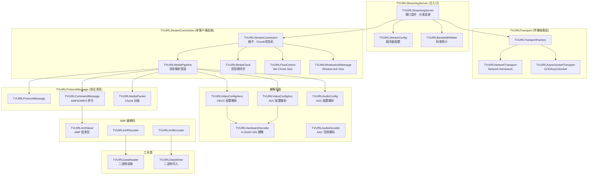
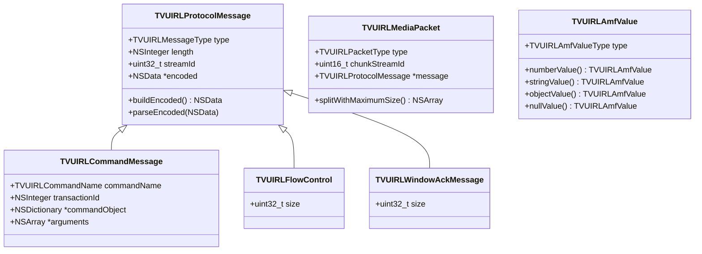
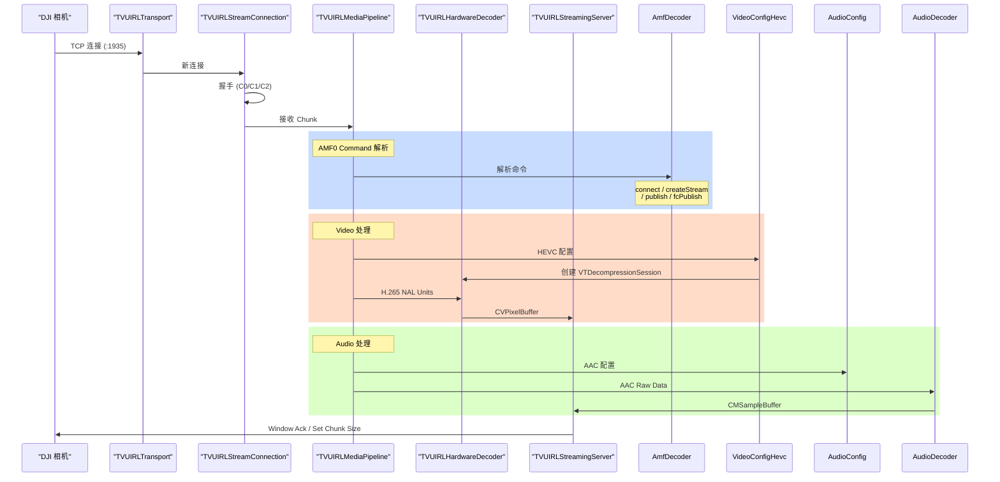
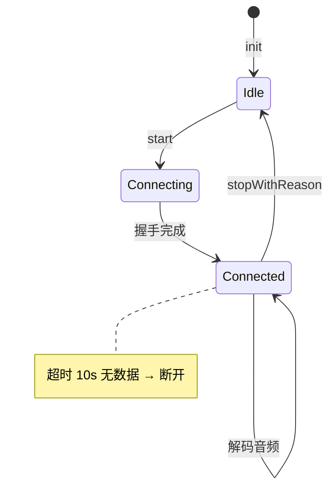

# Moblin RTMP Server 架构与原理

**源项目：** Moblin (eerimoq/moblin) - MIT License
**分析目标：** RTMPServerObjc 移植参考

---

## 一、整体定位

Moblin 的 RTMP Server 是一个 **RTMP Ingest Server**（接收端），用于接收 DJI Osmo Action 5 Pro 相机推送的直播流。

```
┌─────────────────────────────────────────────────────────────┐
│                     iPhone: Moblin App                        │
│                                                             │
│   ┌─────────────────┐         ┌──────────────────────────┐  │
│   │  BLE 控制通道    │         │   RTMP Ingest 视频通道  │  │
│   │  (CoreBluetooth)│         │   (Network.framework)   │  │
│   │                 │         │                          │  │
│   │  DJIStreamCtrl  │         │  RTMPIngestController   │  │
│   │    │           │         │    │                    │  │
│   │    ├─ Scanner  │         │    ├─ RtmpServer       │  │
│   │    └─ DjiDevice│         │    │   └─ NWListener    │  │
│   │        (GATT)  │         │    │      :1935         │  │
│   │                 │         │    ├─ RtmpServerClient │  │
│   │                 │         │    │   (per TCP conn)  │  │
│   │                 │         │    └─ PreviewView     │  │
│   └───────┬─────────┘         └────────────┬───────────┘  │
│           │ BLE FFF5 (write)                │              │
│           │ BLE FFF4 (notify)                │ RTMP/TCP    │
│           ▼                                 ▼              │
│   ┌─────────────────────────────────────────────────────┐  │
│   │          DJI Osmo Action 5 Pro                       │  │
│   │                                                      │  │
│   │  1. 收到 BLE 指令 → 连接指定 Wi-Fi                  │  │
│   │  2. 推 RTMP 到指定 URL（H.265 video + AAC audio）   │  │
│   └─────────────────────────────────────────────────────┘  │
└─────────────────────────────────────────────────────────────┘
```

**两条通道同时运行：**
- **BLE 通道**：只负责发送控制命令（配对、配置 Wi-Fi、启动/停止推流）
- **RTMP 通道**：接收相机推送的音视频数据，完全走 Wi-Fi + TCP

---

## 二、代码结构

```
Ingest/
├── HaishinKit/
│   ├── Codec/
│   │   └── VideoDecoder.swift              # H.264/H.265 硬解码
│   ├── Media/
│   │   ├── PreviewView.swift               # 视频预览
│   │   └── TargetLatenciesSynchronizer.swift # 音视频同步
│   ├── Mpeg/
│   │   ├── Avc/                            # H.264 NAL 单元解析
│   │   │   ├── AvcNalUnit.swift
│   │   │   ├── AvcNalUnitSps.swift
│   │   │   ├── AvcNalUnitPps.swift
│   │   │   └── MpegTsVideoConfigAvc.swift
│   │   ├── Hevc/                           # H.265 NAL 单元解析
│   │   │   ├── HevcNalUnit.swift
│   │   │   ├── HevcNalUnitVps.swift
│   │   │   ├── HevcNalUnitSps.swift
│   │   │   ├── HevcNalUnitPps.swift
│   │   │   └── MpegTsVideoConfigHevc.swift
│   │   └── MpegTsAudioConfig.swift         # AAC 音频配置
│   ├── Rtmp/
│   │   ├── Amf/
│   │   │   └── Amf.swift                   # AMF0 编解码
│   │   ├── Message/
│   │   │   ├── RtmpCommandMessage.swift    # 命令消息
│   │   │   ├── RtmpWindowAcknowledgementSizeMessage.swift
│   │   │   ├── RtmpSetChunkSizeMessage.swift
│   │   │   ├── RtmpSetPeerBandwidthMessage.swift
│   │   │   └── RtmpAcknowledgementMessage.swift
│   │   └── RtmpChunk.swift                 # Chunk 封装
│   └── Util/
│       ├── BitrateStats.swift               # 码率统计
│       ├── ByteReader.swift                 # 二进制读取
│       └── ByteWriter.swift                 # 二进制写入
└── RtmpServer/
    ├── RtmpServer.swift                     # 主服务器（NWListener）
    ├── RtmpServerClient.swift               # 客户端连接处理
    ├── RtmpServerChunkStream.swift          # Chunk 流解析
    └── SettingsRtmpServer.swift             # 服务器配置
```

---

## 三、RTMP 握手流程

RTMP 连接建立需要 3 步握手（基于 TCP）：

```
客户端（DJI相机）                    服务器（Moblin）
     │                                   │
     │──────── C0 (1 byte) ─────────────→│  版本号 = 3
     │──────── C1 (1536 bytes) ─────────→│  时间戳(4) + 0(4) + 随机数(1528)
     │                                   │
     │←──────── S0 (1 byte) ─────────────│  版本号 = 3
     │←──────── S1 (1536 bytes) ─────────│  时间戳 + 0 + 随机数
     │←──────── S2 (1536 bytes) ─────────│  C1 的前 8 字节 + C1[9...]
     │                                   │
     │──────── C2 (1536 bytes) ─────────→│  S1 原样返回
     │                                   │
     ▼                                   ▼
  开始发送 RTMP Chunk                  开始接收 RTMP Chunk
```

**Moblin 实现（RtmpServerClient.swift）：**

```swift
private func handleDataUninitialized(data: Data) {
    // data[0] = C0 版本号（必须为 3）
    // data[1..4] = C1 时间戳
    // data[5..8] = C1 保留位
    // data[9..] = C1 随机数

    let version = data[0]
    guard version == rtmpVersion else { return }  // rtmpVersion = 3

    // 发送 S0（1字节版本号）
    send(data: Data([rtmpVersion]))

    // 发送 S1（1536字节）
    var s1 = Data([0, 0, 0, 0, 0, 0, 0, 0])  // 时间戳 + 0
    s1 += Data.random(length: 1528)          // 随机数
    send(data: s1)

    // 发送 S2（1536字节，复制 C1 的时间戳和随机数部分）
    var s2 = Data([data[1], data[2], data[3], data[4], 0, 0, 0, 0])
    s2 += data[9...]  // 复制 C1 的随机字段
    send(data: s2)

    state = .versionSent
    receiveData(size: 1536)  // 等待接收 C2
}
```

**握手完成后的状态转换：**
```
uninitialized → versionSent → ackSent → handshakeDone
```

---

## 四、RTMP Chunk 解析机制

### 4.1 Chunk 结构

```
┌──────────────────────────────────────────────────────────┐
│                      RTMP Chunk                           │
├───────────────┬──────────────────┬───────────────────────┤
│ Basic Header  │  Message Header   │   Chunk Data          │
│   1-3 bytes   │  0/3/7/11 bytes   │   (variable)         │
├───────────────┴──────────────────┴───────────────────────┤
│                                                          │
│  Basic Header:                                           │
│    [format(2bit)][chunk_stream_id(6/14/22bit)]           │
│                                                          │
│  Message Header (Type 0-3):                             │
│    Type 0: timestamp(3) + length(3) + type(1) + streamId(4) = 11 bytes
│    Type 1: timestamp(3) + length(3) + type(1)           = 7 bytes
│    Type 2: timestamp(3)                                 = 3 bytes
│    Type 3: (no header, reuse last)                      = 0 bytes
│                                                          │
│  Extended Timestamp:                                     │
│    4 bytes (only if timestamp >= 0xFFFFFF)              │
│                                                          │
└──────────────────────────────────────────────────────────┘
```

### 4.2 Basic Header 格式

```swift
// chunk_stream_id 0-63：1字节
[format(2bit)][chunk_stream_id(6bit)]

// chunk_stream_id 64-319：2字节
[format(2bit)][00(6bit)][chunk_stream_id - 64]

// chunk_stream_id 320+：3字节
[format(2bit)][01(6bit)][chunk_stream_id - 64 (16bit big-endian)]
```

### 4.3 消息分块示例

假设一个 10000 字节的消息，chunk_size = 128：

```
Chunk 0: [Type 0 Header][............128 bytes data............]
Chunk 1: [Type 3 Header][............128 bytes data............]
Chunk 2: [Type 3 Header][............128 bytes data............]
...
Chunk 77:[Type 3 Header][.............64 bytes data............]
```

### 4.4 Moblin 实现

```swift
// 状态机追踪解析进度
private enum ChunkState {
    case basicHeaderFirstByte
    case messageHeaderType0
    case messageHeaderType1
    case messageHeaderType2
    case extendedTimestamp
    case data
}

// Type 0 完整头（11字节）
private func handleDataHandshakeDoneMessageHeaderType0(data: Data) {
    chunkStream.messageTimestamp = data.getThreeBytesBe()           // 时间戳 3B
    chunkStream.messageLength = Int(data.getThreeBytesBe(offset: 3)) // 长度 3B
    chunkStream.messageTypeId = data[6]                             // 类型 1B
    chunkStream.messageStreamId = data.getFourBytesLe(offset: 7)  // stream ID 4B (LE)
}

// 数据累积直到完整消息
func handleBody(data: Data) {
    messageBody += data
    if messageRemain() == 0 {
        processMessage()
        messageBody.removeAll(keepingCapacity: true)
    }
}
```

---

## 五、AMF0 命令协议

### 5.1 AMF0 数据类型

| Type | Value | 说明 |
|------|-------|------|
| Number | 0x00 | 8字节 Double |
| Boolean | 0x01 | 1字节 |
| String | 0x02 | 2字节长度 + UTF-8 |
| Object | 0x03 | 键值对集合 |
| Null | 0x05 | 空值 |
| Undefined | 0x06 | 未定义 |
| EcmaArray | 0x08 | 关联数组 |
| ObjectEnd | 0x09 | 对象结束标记 |

### 5.2 典型命令序列

```
客户端（DJI相机）                    服务器（Moblin）
     │                                   │
     │──── connect(tcurl, app...) ─────→│
     │←─── _result(NetConnection.Success)│
     │                                   │
     │──── createStream ───────────────→│
     │←─── _result(streamId=1) ──────────│
     │                                   │
     │──── fcPublish(streamKey) ─────────→│
     │                                   │
     │──── publish(streamKey) ───────────→│
     │←─── onStatus(NetStream.Publish.Start)
     │                                   │
     │──── [Video Data] ─────────────────→│
     │──── [Audio Data] ─────────────────→│
```

### 5.3 Moblin 命令处理

```swift
private func processMessageAmf0Command() {
    let decoder = Amf0Decoder(data: messageBody)
    let commandName = try decoder.decodeString()    // "connect", "publish"...
    let transactionId = try decoder.decodeInt()
    let commandObject = try decoder.decodeObject()

    switch commandName {
    case "connect":
        processConnect(transactionId: transactionId, commandObject: commandObject)
    case "publish":
        let streamKey = try decoder.decode()  // stream key
        processPublish(streamKey: streamKey)
    case "createStream":
        processCreateStream(transactionId: transactionId)
    default:
        break
    }
}

// 处理 connect 命令
private func processConnect(transactionId: Int, commandObject: AsObject) {
    guard case let .string(tcUrl) = commandObject["tcUrl"] else {
        client.stopInternal(reason: "tcUrl missing")
        return
    }

    // 回复成功
    sendMessage(chunk: RtmpChunk(
        type: .zero,
        chunkStreamId: 2,  // 控制 chunk stream
        message: RtmpCommandMessage(
            commandName: "_result",
            arguments: [.object([
                "level": .string("status"),
                "code": .string("NetConnection.Connect.Success"),
                "description": .string("Connection succeeded.")
            ])]
        )
    ))
}
```

---

## 六、视频流处理（H.265/HEVC）

DJI Osmo Action 5 Pro 输出 H.265（HEVC）视频流。

### 6.1 FLV Video 扩展头格式

H.265 使用扩展头（与 H.264 不同）：

```
[FrameType(4bit)][PacketType(4bit)][FourCC(4byte)][Data...]

FrameType:
  0x1: H.264/H.265 关键信息
  0x2: H.264/H.265 非关键帧

PacketType:
  0x24: HEVC NAL Units

FourCC: 0x68657663 ("hevc")
```

### 6.2 序列头解析流程

```
1. 接收 HEVCDecoderConfigurationRecord
   ├── VPS (Video Parameter Set)
   ├── SPS (Sequence Parameter Set)
   ├── PPS (Picture Parameter Set)
   └── SEI (Supplemental Enhancement Information)

2. 解析配置创建 CMVideoFormatDescription
   MpegTsVideoConfigHevc.makeFormatDescription()

3. 创建 VTDecompressionSession（硬解码）
   VideoDecoder.startRunning()

4. 接收 NAL Units 并解码
```

### 6.3 Moblin 实现

```swift
private func processMessageVideoExtendedHeader(client: RtmpServerClient, control: UInt8) {
    let frameType = (control >> 4) & 0b111
    let packetType = control & 0b1111

    // FourCC 提取
    let fourCc = UInt32(messageBody[1]) << 24
              | UInt32(messageBody[2]) << 16
              | UInt32(messageBody[3]) << 8
              | UInt32(messageBody[4])

    guard fourCc == 0x68657663 else { return }  // "hevc"

    switch FlvVideoPacketType(rawValue: packetType) {
    case .sequenceStart:
        processMessageVideoTypeSequenceStart(client: client)
    case .codedFrames:
        processMessageVideoTypeCodedFrames(client: client, isKeyFrame: frameType == .key)
    case .sequenceEnd:
        client.stopInternal(reason: "Stream ended")
    default:
        break
    }
}

private func processMessageVideoTypeSequenceStart(client: RtmpServerClient) {
    let hvcC = messageBody.subdata(in: 5 ..< messageBody.count)  // 跳过 5 字节头
    let videoConfig = MpegTsVideoConfigHevc(hvcC: hvcC)

    var formatDescription: CMVideoFormatDescription?
    let status = videoConfig.makeFormatDescription(&formatDescription)

    if status == noErr {
        setupVideoEncoderIfNeeded(formatDescription: formatDescription)
    }
}

private func setupVideoEncoderIfNeeded(formatDescription: CMVideoFormatDescription?) {
    guard videoDecoder == nil else { return }

    videoDecoder = VideoDecoder(lockQueue: rtmpServerDispatchQueue)
    videoDecoder.delegate = self
    videoDecoder.startRunning(formatDescription: formatDescription)
}
```

---

## 七、音频流处理（AAC）

### 7.1 FLV Audio 头格式

```
[SoundFormat(4bit)][SoundRate(2bit)][SoundSize(1bit)][SoundType(1bit)][AACPacketType(1byte)]

SoundFormat: 0xA = AAC
SoundRate: 0=5.5kHz, 1=11kHz, 2=22kHz, 3=44kHz
SoundSize: 0=8bit, 1=16bit
SoundType: 0=Mono, 1=Stereo
AACPacketType: 0=Sequence Header, 1=Raw
```

### 7.2 Moblin 实现

```swift
private func processMessageAudio() {
    let control = messageBody[0]
    let codec = FlvAudioCodec(rawValue: control >> 4)  // AAC
    guard codec == .aac else { return }

    switch FlvAacPacketType(rawValue: messageBody[1]) {
    case .seq:
        processMessageAudioTypeSeq(client: client, codec: codec)
    case .raw:
        processMessageAudioTypeRaw(client: client, codec: codec)
    default:
        break
    }
}

private func processMessageAudioTypeSeq(client: RtmpServerClient, codec: FlvAudioCodec) {
    // 解析 AAC 音频配置（AudioSpecificConfig）
    let config = MpegTsAudioConfig(data: [UInt8](messageBody[2...]))

    // 创建音频格式
    var streamDescription = config.audioStreamBasicDescription()
    let audioFormat = AVAudioFormat(streamDescription: &streamDescription)

    // 创建解码器
    audioDecoder = AVAudioConverter(from: audioFormat, to: pcmAudioFormat)
}
```

---

## 八、委托回调（Delegate）

Moblin 定义了 `RtmpServerDelegate` 协议：

```swift
protocol RtmpServerDelegate: AnyObject {
    func rtmpServerOnPublishStart(streamKey: String)
    func rtmpServerOnPublishStop(streamKey: String, reason: String)
    func rtmpServerOnVideoBuffer(cameraId: UUID, _ sampleBuffer: CMSampleBuffer)
    /// Zero-copy path: delivers decoded CVPixelBuffer directly (Metal rendering)
    func rtmpServerOnVideoImageBuffer(cameraId: UUID, _ imageBuffer: CVImageBuffer)
    func rtmpServerOnAudioBuffer(cameraId: UUID, _ sampleBuffer: CMSampleBuffer)
    func rtmpServerSetTargetLatencies(
        cameraId: UUID,
        _ videoTargetLatency: Double,
        _ audioTargetLatency: Double
    )
}
```

---

## 九、完整数据流

```
NWListener.accept()  // 新 TCP 连接
       │
       ▼
RtmpServerClient.start()
       │
       ├─ [握手阶段]
       │     │
       │     ├─ 接收 C0+C1 (1537B) → 发送 S0+S1+S2
       │     ├─ 接收 C2 (1536B) → 发送 S2
       │     └─ 状态: handshakeDone
       │
       └─ [Chunk 解析循环]
             │
             ├─ 接收 Basic Header (1-3B)
             │     └─ 提取 format + chunk_stream_id
             │
             ├─ 接收 Message Header (0/3/7/11B)
             │     └─ 提取 timestamp + length + type + stream_id
             │
             ├─ [可选] 接收 Extended Timestamp (4B)
             │     └─ timestamp >= 0xFFFFFF 时
             │
             ├─ 接收 Chunk Data
             │     └─ 累积到 messageBody
             │
             └─ 消息完整时 processMessage()
                   │
                   ├─ AMF0 Command
                   │     ├─ connect → 回复 NetConnection.Success
                   │     ├─ createStream → 回复 streamId=1
                   │     └─ publish → 回复 NetStream.Publish.Start
                   │
                   ├─ Video (H.265)
                   │     ├─ sequence start → 创建 VTDecompressionSession
                   │     ├─ coded frames → 解码 → CVPixelBuffer
                   │     └─ 回调 delegate.rtmpServerOnVideoImageBuffer()
                   │
                   └─ Audio (AAC)
                         ├─ sequence header → 创建 AVAudioConverter
                         ├─ raw data → 解码 PCM
                         └─ 回调 delegate.rtmpServerOnAudioBuffer()
```

---

## 十、关键设计要点

| 要点 | 说明 |
|------|------|
| **状态机** | `chunkState` 追踪 Chunk 解析阶段 |
| **双缓冲** | `inputBuffer` 暂存网络数据，逐帧处理 |
| **分包合并** | 消息长度 > chunk_size 时分多个 Chunk 传输 |
| **时间戳累加** | Type 3 Chunk 时累加 timestamp |
| **延迟补偿** | `latency` 参数调整播放时间戳 |
| **多客户端管理** | 同一 streamKey 只允许一个客户端 |
| **超时清理** | 10秒无数据则断开客户端 |
| **自动重连** | listener 失败时自动重建 |

---

## 十一、RTMPServerObjc 架构（ObjC 移植版）

### 11.1 整体架构图



### 11.2 类层次关系



### 11.3 消息流向



### 11.4 核心类说明

| 类名 | 职责 | 关键接口 |
|------|------|----------|
| **TVUIRLStreamingServer** | TCP 端口监听，多客户端管理 | `start/stop`, `isStreamConnected`, `updateStats` |
| **TVUIRLTransport** | 传输层抽象 (Protocol-oriented) | `TVUIRLTransportListener`, `TVUIRLTransportConnection` |
| **TVUIRLStreamConnection** | 单客户端握手 + Chunk 状态机 | `start/stopWithReason`, `sendMessagePacket` |
| **TVUIRLMediaPipeline** | 消息体累积 + 分发处理 | `appendChunkData`, `remainingMessageBytes` |
| **TVUIRLProtocolMessage** | RTMP 消息基类 | `buildEncoded`, `parseEncoded` |
| **TVUIRLCommandMessage** | AMF0/AMF3 命令消息 | `connect`, `createStream`, `publish` |
| **TVUIRLHardwareDecoder** | H.264/H.265 硬解码 | `startWithFormatDescription`, `decodeSampleBuffer` |
| **TVUIRLVideoConfigHevc** | HEVC 序列头解析 | `initWithHvcC`, `makeFormatDescription` |
| **TVUIRLAudioConfig** | AAC 音频配置解析 | `initWithData`, `audioStreamBasicDescription` |
| **TVUIRLMediaClock** | 音视频延迟同步 | `setLatestAudioPresentationTimeStamp`, `update` |
| **TVUIRLBandwidthMeter** | 码率统计 | `addBytesTransferred`, `update` |

### 11.5 RTMPServerObjc 文件映射表

| ObjC 文件 | 对应 Swift (Moblin) | 功能 |
|-----------|---------------------|------|
| `TVUIRLStreamingServer.*` | `RtmpServer` | 服务器主入口 |
| `TVUIRLStreamConnection.*` | `RtmpServerClient` | 客户端连接处理 |
| `TVUIRLMediaPipeline.*` | `RtmpServerChunkStream` | Chunk 流解析 |
| `TVUIRLTransport.*` | `RtmpChunk` | Chunk 封装 |
| `TVUIRLCommandMessage.*` | `RtmpCommandMessage` | 命令消息 |
| `TVUIRLWindowAckMessage.*` | `RtmpWindowAcknowledgementSizeMessage` | Window Ack |
| `TVUIRLFlowControl.*` | `RtmpSetChunkSizeMessage` | Set Chunk Size |
| `TVUIRLAmfValue/Encoder/Decoder` | `Amf` | AMF0 编解码 |
| `TVUIRLVideoConfigHevc.*` | `MpegTsVideoConfigHevc` | HEVC 配置 |
| `TVUIRLVideoConfigAvc.*` | `MpegTsVideoConfigAvc` | AVC 配置 |
| `TVUIRLAudioConfig.*` | `MpegTsAudioConfig` | AAC 配置 |
| `TVUIRLHardwareDecoder.*` | `VideoDecoder` | 视频硬解码 |
| `TVUIRLBandwidthMeter.*` | `BitrateStats` | 码率统计 |
| `TVUIRLDataReader.*` | `ByteReader` | 二进制读取 |
| `TVUIRLDataWriter.*` | `ByteWriter` | 二进制写入 |
| `TVUIRLNetworkTransport.*` | Network.framework | 网络传输 |
| `TVUIRLAsyncSocketTransport.*` | GCDAsyncSocket | Socket 传输 |

### 11.6 状态机转换



---

*文档版本：1.0*
*参考：Moblin RTMPServer (MIT License, eerimoq/moblin)*
