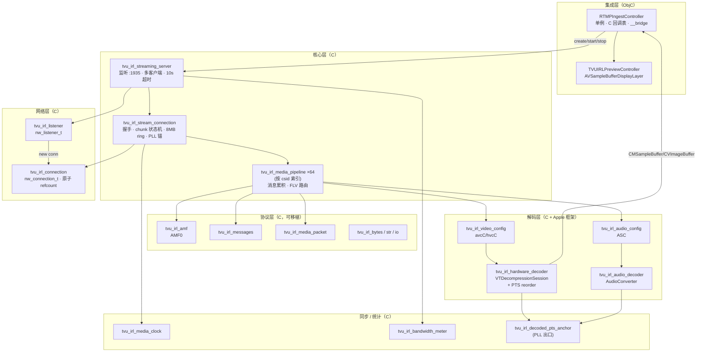
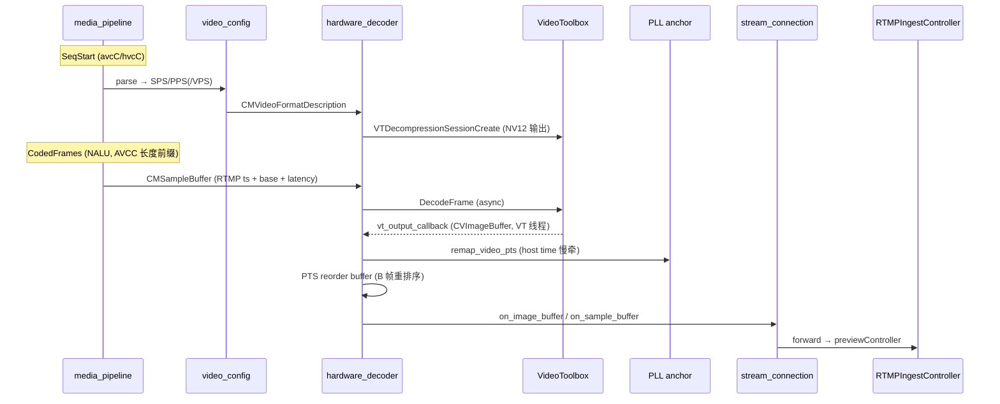

# RTMPServerC 架构与实现说明

**源项目：** Moblin (eerimoq/moblin) - MIT License
**直接前身：** RTMPServerObjc（见 `RTMPServerObjc_Plan.md`）
**语言：** 纯 C（C11，依赖 Apple C 框架：Network / VideoToolbox / AudioToolbox / CoreMedia / CoreVideo / dispatch）
**目录：** `DJIStreamDemo/RTMPServerC/`
**集成层：** `DJIStreamDemo/IngestObjc/RTMPIngestController.{h,m}`（薄 ObjC 桥接）

> 本文档描述把 RTMP Ingest Server 从 Objective-C（`TVUIRL*` 类）重写为**纯 C**（`tvu_irl_*` 模块）后的最终形态。这不是机械翻译，而是一次带深度性能 / 同步优化的重写。阅读前建议先看 `RTMPArchitecture.md`（协议原理）与 `RTMPServerObjc_Plan.md`（ObjC 版设计），本文聚焦 **C 版独有的设计选择与优化**。

---

## 一、为什么要重写为纯 C

| 动机 | 说明 |
|---|---|
| **去 ObjC runtime 开销** | 热路径（每帧 chunk 解析、body 累积）消除 `NSData`/`NSMutableData` 的 retain/release + ARC 内存屏障 + 对象头开销 |
| **去 AVFoundation 依赖** | 音频解码改用 `AudioToolbox.AudioConverter`（C API），不再需要 `AVAudioConverter` / `AVAudioFormat`（ObjC 类） |
| **精确内存控制** | 自管 ring buffer / message body raw buffer，几何增长 + 复用，避免 `NSMutableData` 隐藏的反复分配 |
| **可移植性** | 协议核心（bytes/io/str/amf/messages/media_packet）零 Apple 依赖，理论上可跨平台；仅解码器 + transport 绑定 Apple 框架 |
| **单一职责的 opaque 模块** | 每个 `.h` 暴露 opaque struct + 自由函数，编译期隐藏实现，调用点无 vtable 间接跳转 |

---

## 二、文件清单与分层

`DJIStreamDemo/RTMPServerC/` 共 **21 个模块**（37 个 .c/.h，约 5400 行）：

```
┌─ 基础设施层（零 / 极少 Apple 依赖，可移植）──────────────────────────┐
│  tvu_irl_bytes.{h,c}        替代 NSData/NSMutableData，独占所有权缓冲   │
│  tvu_irl_str.{h,c}          替代 NSString：strv 视图 + str 拥有式       │
│  tvu_irl_io.h               reader 零拷贝视图 + writer 适配（全 inline）│
│  tvu_irl_log.{h,c}          os_log 封装，Release 下 debug 宏编译期消除  │
├─ RTMP 协议层 ──────────────────────────────────────────────────────┤
│  tvu_irl_amf.{h,c}          AMF0 tagged-union 编解码（深度/数量防护）    │
│  tvu_irl_messages.{h,c}     5 种 RTMP 消息（Ack/WindowAck/ChunkSize/   │
│                             Bandwidth/Command），无 vtable              │
│  tvu_irl_media_packet.{h,c} chunk 编码：单 buffer 多块 type-3 续接      │
├─ 网络层 ───────────────────────────────────────────────────────────┤
│  tvu_irl_transport.{h,c}    Network.framework C API + 原子引用计数      │
├─ 核心层 ───────────────────────────────────────────────────────────┤
│  tvu_irl_streaming_server.{h,c}  端口监听 + 多客户端 + 超时探测 + 转发  │
│  tvu_irl_stream_connection.{h,c} 握手 + chunk 状态机 + ring buffer +    │
│                                  PLL PTS 锚 + 64 槽 pipeline            │
│  tvu_irl_media_pipeline.{h,c}    单 csid 消息处理 + FLV 视频/音频路由   │
├─ 媒体格式 / 解码层 ────────────────────────────────────────────────┤
│  tvu_irl_video_config.{h,c}      avcC/hvcC → CMVideoFormatDescription  │
│  tvu_irl_audio_config.{h,c}      AudioSpecificConfig → ASBD（纯 POD）   │
│  tvu_irl_hardware_decoder.{h,c}  VTDecompressionSession + PTS reorder   │
│  tvu_irl_audio_decoder.{h,c}     AudioConverter：AAC → PCM 48k/stereo   │
├─ 辅助层 ───────────────────────────────────────────────────────────┤
│  tvu_irl_media_clock.{h,c}       音视频延迟同步决策（EMA）              │
│  tvu_irl_bandwidth_meter.{h,c}   输入码率统计（EMA 平滑）              │
│  tvu_irl_stream_config.{h,c}     profile（streamKey/latency/uuid）+config│
│  tvu_irl_decoded_pts_anchor.h    PTS 重锚函数指针接口（PLL 出口）       │
└────────────────────────────────────────────────────────────────────┘
```

---

## 三、命名映射（ObjC → C）

| RTMPServerObjc（ObjC 类） | RTMPServerC（C 模块） | 形态变化 |
|---|---|---|
| `TVUIRLDataReader` / `TVUIRLDataWriter` | `tvu_irl_reader_t`（io.h） / `tvu_irl_bytes_t` | 视图 reader + 统一 bytes writer |
| `NSData` / `NSMutableData` | `tvu_irl_bytes_t` | 独占所有权，move/clone/take |
| `NSString` | `tvu_irl_strv_t`（视图） / `tvu_irl_str_t`（拥有） | 双类型，零拷贝传参 |
| `TVUIRLAmfValue/Encoder/Decoder` | `tvu_irl_amf_value_t` + 自由函数 | Swift enum → C tagged union |
| `TVUIRLProtocolMessage` + 子类 | `tvu_irl_*_message_t`（messages.h） | 无 vtable，独立 struct + type tag |
| `TVUIRLMediaPacket` | `tvu_irl_media_packet_emit()` | 类 → 无状态自由函数 |
| `TVUIRLTransport` / `TVUIRLNetworkTransport` | `tvu_irl_listener_t` / `tvu_irl_connection_t` | 协议抽象 → opaque struct（仅 Network.framework） |
| `TVUIRLStreamingServer` | `tvu_irl_streaming_server_t` | |
| `TVUIRLStreamConnection` | `tvu_irl_stream_connection_t` | |
| `TVUIRLMediaPipeline` | `tvu_irl_media_pipeline_t` | |
| `TVUIRLVideoConfigAvc` + `…Hevc` | `tvu_irl_video_config_avc_t` + `…hevc_t` | 合并到一个模块 |
| `TVUIRLAudioConfig` | `tvu_irl_audio_config_t` | 纯 POD |
| `TVUIRLHardwareDecoder` | `tvu_irl_hardware_decoder_t` | + PTS reorder buffer |
| `TVUIRLAudioDecoder`（AVAudioConverter） | `tvu_irl_audio_decoder_t`（AudioConverter） | 去 AVFoundation |
| `TVUIRLMediaClock` | `tvu_irl_media_clock_t` | |
| `TVUIRLBandwidthMeter` | `tvu_irl_bandwidth_meter_t` | |
| `TVUIRLStreamConfig` / `TVUIRLStreamProfile` | `tvu_irl_stream_config_t` / `tvu_irl_stream_profile_t` | |
| `TVUIRLDecodedPtsAnchor`（协议） | `tvu_irl_decoded_pts_anchor_t`（函数指针表） | |
| `TVUIRLDJILog` | `tvu_irl_log.h`（os_log 宏） | |
| `MetalPreviewView`（Swift） | `TVUIRLPreviewController`（AVSampleBufferDisplayLayer） | Metal → display layer |

---

## 四、整体架构



**分层依赖原则：** 上层依赖下层，下层不知道上层（`stream_connection` / `media_pipeline` 通过前向声明 + friend 风格自由函数互相调用，避免暴露完整 struct）。

---

## 五、核心数据流

### 5.1 连接建立与握手

```
nw_listener accept
  → on_new_connection (streaming_server.c)
  → tvu_irl_stream_connection_create  (8MB ring 一次性 malloc)
  → tvu_irl_stream_connection_start   (transport_start → schedule_receive)

握手（冷路径，ring 内消费）：
  C0+C1 (1537B) ──→ 校验 version==3
                ←── S0 (1B=3)
                ←── S1 (1536B：8 字节 0 + 1528 随机)
                ←── S2 (1536B：C1[0..3] + 0×4 + C1[8..1535])
  C2 (1536B)    ──→ HS_DONE
```
实现：`stream_connection.c` `process_received()` → `handshake_c0c1()` / `handshake_c2_done()`。

### 5.2 Chunk 解析状态机（热路径）

`process_received()` 主循环（`stream_connection.c:445`）逐字节状态机：

```
CHUNK_BASIC_HEADER_FIRST_BYTE   → format(2bit) + csid(6bit)；按 csid 取/建 pipeline slot
CHUNK_MSG_HEADER_TYPE0 (11B)    → 绝对 ts + len + typeId + streamId(LE)
CHUNK_MSG_HEADER_TYPE1 (7B)     → 相对 ts + len + typeId
CHUNK_MSG_HEADER_TYPE2 (3B)     → 仅相对 ts
CHUNK_EXTENDED_TIMESTAMP (4B)   → ts==0xFFFFFF 时
CHUNK_DATA                      → min(chunkSize, remaining) 字节 → ring_consume_to_pipeline
```
- csid 0（2 字节头）/ csid 1（3 字节头）**未实现**，遇到即 stop（DJI 不使用）。
- type-3 chunk 复用上一条消息头；若上条标记 ext-ts，则 type-3 也先读 4 字节 ext-ts。

### 5.3 消息分发（pipeline）

满消息时 `media_pipeline.c` `append_chunk_bytes()` → `process_message()`：

| message type id | 处理 |
|---|---|
| `0x14` AMF0 Command | `process_amf0_command` → connect / createStream / publish / FCPublish… |
| `0x12` AMF0 Data | 忽略（`@setDataFrame` 等 metadata） |
| `0x01` Set Chunk Size | 更新 `chunk_size_from_client` |
| `0x05` Window Ack Size | 更新 `window_ack_size` |
| `0x09` Video | `process_video` → AVC / HEVC 路由 |
| `0x08` Audio | `process_audio` → AAC 路由 |

### 5.4 命令往返（与 Moblin 一致）

```
connect(tcUrl=…/live)
  ──→ WindowAck(500000) + SetPeerBandwidth(10000000,dynamic) + SetChunkSize(128)
  ──→ _result(NetConnection.Connect.Success)
createStream            ──→ _result(streamId = 1)
FCPublish / releaseStream / deleteStream  →  no-op
publish(streamKey)
  ──→ 校验 streamKey ∈ config.streams
       命中：complete_publish（置 CONNECTED，踢同 key 旧连接） + onStatus(NetStream.Publish.Start)
       未命中：stop("Stream key … not configured")
```
> `tcUrl` 校验：取第三个 `/` 起的 path，必须**精确等于** `/live`（`media_pipeline.c:254` `handle_connect`）。

### 5.5 视频解码链



关键时间戳（`media_pipeline.c` `emit_video_frame`）：
```
video_timestamp = media_timestamp - media_timestamp_zero   // 相对 publish 起点
pts_ms = video_timestamp + base + composition_time + latency
dts_ms = video_timestamp + base + latency
base   = 1000 * CACurrentMediaTime()  // 首帧锚定的 host time（毫秒）
```

### 5.6 音频解码链

```
SeqHeader(AudioSpecificConfig) → audio_config parse → AudioConverterNew(AAC→PCM)
RawAAC → audio_decoder_decode_aac → AudioConverterFillComplexBuffer
       → remap_audio_pts（PLL，video basetime 未就绪则丢帧）
       → CMSampleBuffer → on_audio_sample_buffer
```
> Demo 当前不消费音频（`RTMPIngestController.m` `on_audio_sample_buffer` 空实现），但整条解码链已就绪。

---

## 六、关键优化（C 版相对 ObjC 的提升）

这是 C 版的核心价值所在。对应 commit `添加优化方案` / `优化过后的代码调试`。

### 6.1 8MB Ring Buffer + Overflow 旁路

`stream_connection.c:36` `ring_buffer_t` + `overflow_buf_t`。替代 ObjC 的 `NSMutableData inputBuffer` 累积模式：

- 连接创建时**一次性** `malloc(8MB)`，整个生命周期不再分配
- 写入优先走 ring；尾部连续空间不够时尝试 wrap 到头部（`valid_end` 标记有效区尾界）；ring 满则进 overflow 旁路（256KB→4MB 几何增长）
- `ring_consume_to_pipeline()` 把 chunk data **零拷贝分段**直接喂给 pipeline（跨 wrap 时两段 memcpy）
- 消除了"每次 receive 追加 NSMutableData + 解析后移除已消费前缀"的反复内存移动

### 6.2 64 槽 Pipeline 数组（替代 NSDictionary）

`stream_connection.c` `pipeline_slots[64]`，按 chunk stream id 直接下标索引（O(1)，无哈希、无 retain）。RTMP csid 6-bit 单字节范围即 2-63，64 槽足够覆盖单字节 basic header。

### 6.3 PLL 锁相环 PTS 锚点（新增能力）

`stream_connection.c` `remap_video_pts` / `remap_audio_pts`（经 `decoded_pts_anchor` 注入解码器出口）。把"流内 PTS"折回 host time 域，吸收异步解码 / IDR 等待抖动：

| 参数 | 值 | 作用 |
|---|---|---|
| basetime 时基 | 微秒（10⁶） | 锚点精度 |
| EMA α | 0.005 | drift 低通滤波 |
| PLL gain | 0.01 | 每帧修正比例 |
| 单帧最大修正 | 1.0 ms | 防跳变 |
| panic 阈值 | 5000 ms | 超过即整体复位重锚 |

- **video**：首帧锚定 `anchor_basetime = now`；之后 `new_pts = basetime + (pts - first_pts)`，并用滤波后的 drift 慢牵 basetime（每帧 ≤1ms）。drift 失控（>5s）则 panic reset。
- **audio**：跟随 video 的 `anchor_basetime`；video basetime 未就绪时**丢音频帧**（返回 `kCMTimeInvalid`）；输出做单调 clamp 防回退。
- 并发保护：`os_unfair_lock`（video 在 VT 线程、audio 在 server 线程并发访问）。

### 6.4 PTS Reorder Buffer（B 帧重排序，新增能力）

`hardware_decoder.c` `ingest_into_reorder`。首次发现 `PTS != DTS`（含 B 帧）时开启 depth=4 的按 PTS 插入排序缓冲（容量上限 8 帧，溢出强制弹最小 PTS），保证渲染端 PTS 单调。无 B 帧时直通零延迟。

### 6.5 receive batch mode（自适应批量接收）

`transport.c` `nw_connection_receive(min_bytes, 131072)`。握手期 `min_bytes=1`（每包即回调，低延迟）；`stream_connection.c` `maybe_enable_receive_batch_mode()` 在收到首个 >1024 字节的真实视频帧后切到 `min_bytes=8192`，回调率从 ~250/s 降到 ~30/s，大幅降低高码率下的队列唤醒开销。

### 6.6 单 buffer 多块 chunk 编码

`media_packet.c` `tvu_irl_media_packet_emit()`：一次产出**完整连续字节流**（含 basic/msg header + 可选 ext-ts + body，body 超 chunk size 时自动用 type-3 续接），caller 单次 `nw_connection_send`。替代 ObjC 的 `NSArray<NSData*>` 分块 + 逐块 write（少 N-1 次 socket 写 + N 次对象分配）。

### 6.7 去 AVFoundation：AudioConverter C API

`audio_decoder.c` 用 `AudioToolbox.AudioConverter`（纯 C）做 AAC→PCM（48kHz/stereo/Int16/interleaved），一次性完成解码+重采样+声道适配。彻底移除 `AVAudioConverter`/`AVAudioFormat`/`AVAudioPCMBuffer`（ObjC 类）依赖。`output_buffer` 在 configure 时按 `ceil(1024 * 48000/src_rate)+16` 帧预分配并每次 decode 复用。

### 6.8 其他

- **零拷贝 reader**：`io.h` reader 仅持 (ptr,len,pos) 视图，每个 read 内联 + 边界检查；`transport.c` receive 用 `dispatch_data_create_map`（contiguous 时零拷贝）。
- **os_log 编译期消除**：`log.h` Release 下 `TVU_IRL_LOG` 退化为 `((void)0)`；error/fault 保留。
- **bandwidth meter 真 EMA**：`speed_change_rate` 默认 **10**（≈EMA α=0.1）。ObjC 版默认 100（退化为非平滑即时差值），此处是行为改进。

---

## 七、内存与所有权模型

C 没有 ARC，所有权靠**约定 + 严格 init/destroy 配对**表达，注释里逐个标注：

| 资源类别 | 约定 |
|---|---|
| `tvu_irl_bytes_t` / `tvu_irl_str_t` | 独占所有权；`init*` ↔ `destroy` 配对；`move`（转移并清空 src）、`clone`（深拷贝）、`take`（转出裸指针，caller `free`） |
| `tvu_irl_amf_value_t` | tagged union 递归拥有子节点；`tvu_irl_amf_destroy` 递归释放；`object_set`/`array_append`/`add_argument` **转移** value 所有权 |
| 分配失败 | `malloc/realloc/calloc` 返回 NULL 一律 `abort()`（iOS 进程内不可恢复，早 fail 优于静默丢数据） |
| CoreFoundation 对象 | `CFRetain`/`CFRelease` 显式配对（format desc、sample buffer、block buffer、image buffer） |
| nw / dispatch 对象 | 非 ARC C 下用 `os_retain`/`os_release`、`dispatch_retain`/`dispatch_release` |
| transport listener/connection | **原子引用计数**：caller 持 1，每个 in-flight nw block 持 1，归零才 free —— 彻底杜绝 "async callback fires after destroy" |
| stream_connection 销毁 | server 通过 `dispatch_async` 到串行队列**异步销毁**，保证当前帧 `process_received` 完整返回后才 free（防栈上 UAF，`streaming_server.c:114`） |

---

## 八、线程与并发模型

```
┌────────────────────────────────────────────────────────────┐
│ server queue（串行，com.tvunetworks.rtmp-server,            │
│              QOS_USER_INITIATED）                            │
│   · nw_listener / nw_connection 的 receive/failure 回调     │
│   · 握手、chunk 解析、消息处理、命令回复、发包               │
│   · audio decode（AudioConverterFillComplexBuffer 同步）    │
│   · 周期超时探测（3s 间隔，10s 无数据则断开）               │
├────────────────────────────────────────────────────────────┤
│ VideoToolbox 内部线程                                       │
│   · vt_output_callback → PLL remap → reorder buffer         │
│     (pthread_mutex) → emit → 转发到 ObjC delegate           │
└────────────────────────────────────────────────────────────┘

跨线程共享态及其保护：
  · PLL anchor 状态      → os_unfair_lock（video VT 线程 / audio server 线程）
  · reorder buffer       → pthread_mutex（hardware_decoder 内）
  · lifecycle / last_video_rtmp_ts → _Atomic
  · transport refcount / cancelled / batch_min_bytes → _Atomic
```

> ⚠️ 注意：视频 sample/image buffer 的 delegate 回调发生在 **VT 线程**，`TVUIRLPreviewController` 内部需自行切主线程渲染（`AVSampleBufferDisplayLayer` 的 enqueue 需在合适线程）。

---

## 九、与 ObjC / Swift 版的差异对照

| 维度 | Swift(Moblin) | RTMPServerObjc | **RTMPServerC** |
|---|---|---|---|
| 内存累积 | `Data` 追加 | `NSMutableData` | **8MB ring + overflow** |
| csid → 流映射 | Dictionary | `NSDictionary` | **64 槽数组** |
| chunk 发送 | 分块 Data | `NSArray<NSData*>` 逐块 write | **单 buffer 一次 write** |
| 音频解码 | AVAudioConverter | AVAudioConverter | **AudioConverter（C）** |
| 网络层 | NWListener | Network + GCDAsyncSocket 双后端 | **仅 Network.framework** |
| 预览 | Metal PreviewView | MetalPreviewView(Swift) | **AVSampleBufferDisplayLayer** |
| 音视频同步 | TargetLatencies | MediaClock | MediaClock **+ PLL 重锚** |
| B 帧处理 | — | — | **PTS reorder buffer** |
| 接收策略 | 固定 | 固定 | **自适应 batch（1→8192）** |
| 日志 | logger(print) | NSLog | **os_log（Release 消除）** |
| HEVC FourCC | `hvc1` | `hvc1` | `hvc1`（0x68766331） |

---

## 十、集成方式（RTMPIngestController 桥接）

`IngestObjc/RTMPIngestController.m` 是 C server 的唯一调用者，桥接极薄：

```objc
// C 回调表 + (__bridge void *)self；单例 self 全程存活，__bridge 无所有权转移
tvu_irl_server_callbacks_t cb = {
    .on_publish_start       = on_publish_start,     // → delegate
    .on_publish_stop        = on_publish_stop,      // → delegate
    .on_video_sample_buffer = on_video_sample_buffer, // → previewController
    .on_video_image_buffer  = on_video_image_buffer,  // → previewController
    .on_audio_sample_buffer = on_audio_sample_buffer, // 空实现
    .user                   = (__bridge void *)self,
};
_server = tvu_irl_streaming_server_create(&cfg, cb);  // config 内部深拷贝
tvu_irl_streaming_server_start(_server);
```

公开 API（`startWithPort:streamKey:` / `stop` / `isRunning` / `updateStats` / `latency` / `noDelay` / `previewEnabled`）与旧版兼容，`ViewController` 调用方无需改动。`frameQueueSize` 为废弃兼容字段。

---

## 十一、已知风险与待验证点

> 对标 `RTMPServerObjc_Plan.md` 第十章。以下为**代码审查发现**，正常 DJI 推流路径下多数不触发，但建议收口 / 实机验证。

### 11.1 代码层面（建议改进）

1. **pipeline 错误路径用 `stop` 而非 server `did_disconnect`（中）**
   `media_pipeline.c` 所有协议错误（不支持的 codec、body too short、AMF decode error…）调用 `tvu_irl_stream_connection_stop()`，它只 cancel transport + 置 IDLE，**不**触发 `on_publish_stop` 回调、**不**从 server `connections[]` 移除、**不**销毁连接。后果：协议错误时上层 UI 收不到"流停止"通知，连接滞留到 **10s periodic 超时**才真正清理。建议让 pipeline 错误也走 `streaming_server_connection_did_disconnect`（销毁是异步的，调用栈安全）。

2. **主解析循环 stop 后不退出（中低）**
   `process_received()` 的 `while (ring.used > 0)` 在 stop 后不检测 `lifecycle`，会继续处理 ring 中剩余数据（对已 stop 的 decoder 调 decode，VT 通常以 `kVTInvalidSessionErr` 安全拒绝，但属无谓开销）。建议循环顶部检查 `lifecycle == IDLE` 即 break。

3. **Window Ack 通告值与回 Ack 阈值不一致（低）**
   `handle_connect` 通告客户端 `WindowAck=500000`，但服务器自身回 Acknowledgement 的阈值用的是 `window_ack_size`（默认 2_500_000，仅被客户端发来的 Window Ack 消息更新）。即服务器实际每 2.5MB 才回一次 ack，而非通告的 500KB。DJI 作为推流端一般不据此限流，影响很低，但技术上不严格自洽。

### 11.2 运行时未验证（需实机联调）

| 路径 | 风险点 |
|---|---|
| RTMP 握手 | S0+S1+S2 是否被相机视为合法；Wireshark 抓包确认 |
| AMF 往返 | DJI 固件是否走标准 connect→createStream→publish |
| `tcUrl` 校验 | 严格匹配 `/live`，若相机 app 名 / path 带变体会被拒 |
| H.264 多 SPS/PPS | 当前只保留最后一组（与 ObjC/Moblin 一致），未验证多组实流 |
| PLL 参数 | EMA α / PLL gain / 1ms 修正在真实 DJI 抖动下的收敛表现 |
| reorder depth=4 | DJI HEVC 是否真含 B 帧、depth 是否足够 |
| AudioConverter priming | 首次 fill 可能 0 帧输出，已有 `num_packets==0` 保护 |

---

## 十二、关键常量速查

| 常量 | 值 | 位置 |
|---|---|---|
| RTMP version | 3 | stream_connection.c |
| Ring buffer 容量 | 8 MB | `RING_CAPACITY` |
| Overflow init / max | 256 KB / 4 MB | `OVERFLOW_INIT_CAP/MAX_CAP` |
| message body init / max | 4 KB / 2 MB | `MSGBODY_INIT_CAP/MAX_CAP` |
| pipeline 槽位 | 64（按 csid 索引） | `pipeline_slots[64]` |
| 最大并发连接 | 8 | `MAX_CONNECTIONS` |
| 接收超时 | 10 s（3s 探测间隔） | `RECEIVE_TIMEOUT_SECONDS` |
| 默认 chunk size | 128 | |
| 默认 window ack size | 2_500_000 | |
| connect 通告 | WindowAck 500000 / Bandwidth 10000000 dynamic / ChunkSize 128 | handle_connect |
| AMF 最大嵌套深度 / 数组数 | 16 / 128 | amf.c |
| nw receive min / max | 1 或 8192 / 131072 | transport.c |
| 视频输出像素格式 | NV12（420YpCbCr8BiPlanarVideoRange） | hardware_decoder.c |
| 音频输出格式 | 48 kHz / stereo / Int16 / interleaved | audio_decoder.c |
| HEVC FourCC | `hvc1`（0x68766331） | media_pipeline.c |
| NAL 长度前缀 | 4 字节 | video_config.c |
| reorder depth / cap | 4 / 8 | hardware_decoder.c |
| PLL EMA α / gain / 单帧修正 / panic | 0.005 / 0.01 / 1ms / 5000ms | stream_connection.c |

---

*生成时间：2026-05-29*
*基于源码完整通读（37 个 .c/.h + RTMPIngestController）撰写，技术细节零猜测。*
*参考：Moblin RTMPServer (MIT License, eerimoq/moblin)、RTMPServerObjc_Plan.md*
